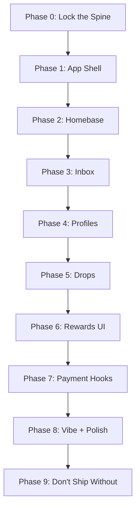

# 3ROTIX UI + Integration Plan

This document outlines the phased rollout for the 3ROTIX platform's user interface and integration features. Tasks are organized by phase with specific, actionable items.

## Completed Tasks
- [x] Implement JOIN_SQUAD XP trigger (50 XP for joining squads)
- [x] Implement PROFILE_CREATED XP trigger (25 XP for creating profile)

## Phase Overview

## Detailed Task List

### Phase 0: Lock the Spine (Non-negotiables)
- [x] Make Homebase the default post-login landing (`/homebase`)
- [x] Enforce one canonical Auth flow (Supabase JWT → server verify → user)
- [x] Enforce one canonical Prisma client + one canonical Supabase client
- [x] Enforce XP only via centralized service (no inline XP logic)
- [x] Enforce Socket.IO security (never trust client userId; verify JWT on connect)

### Phase 1: App Shell (Unified Feel)
- [x] Build AppShell layout (Topbar + Nav + RightDrawer)
- [x] Mobile nav (bottom): Homebase / Explore / Drops / Inbox / Me
- [x] Desktop nav (left): same items
- [x] Add Profile Chip in topbar (avatar + level pill + quick menu)
- [x] Add Quick Action button ("+"): context-aware (post / drop / message / go live later)

### Phase 2: Homebase (Squads + Chat = Heartbeat)
- [x] Homebase layout: Squad list + Chat panel + Squad info side panel
- [x] "Create/Join Squad" flow from Homebase
- [x] Add ProfilePeekCard on username hover/tap in chat
- [x] Add message action row: reply, react, tip (disabled), share drop
- [x] Add pinned cards in chat: "Rules / Featured offer / Squad link"
- [x] Wire XP toast to chat events (small + clean)

### Phase 3: Inbox (One Nervous System)
- [ ] Create `/inbox` with tabs: DMs, Mentions, Activity, Rewards
- [ ] Add "Mark read" + filters (unread / by squad / by creator)
- [ ] Make notifications clickable → deep-link to thread/drop/profile

### Phase 4: Profiles (Identity Layer Everywhere)
- [ ] Create public profile route: `/c/[handle]`
- [ ] Profile sections: Header, About + links, Featured, Drops preview, Offers preview
- [ ] Add DM button everywhere → opens chat drawer/thread
- [ ] Add creator "Boundaries" block (DM rules, collab rules, opt-ins)

### Phase 5: Drops (Content Without Chaos)
- [ ] Create `/drops` global feed
- [ ] Implement DropCard (preview, creator chip, actions)
- [ ] Add "Share to Squad" + "Send in DM"
- [ ] Add "Pin drop to profile"
- [ ] Add basic post types: text + image + clip

### Phase 6: Rewards UI (Ambient, Not Spammy)
- [ ] Add subtle XP progress ring/bar on Profile Chip
- [ ] Add "Level up / badge earned" modal for big moments
- [ ] Add weekly recap card in Homebase ("You gained X XP…")
- [ ] Add `/me/rewards` for deep history

### Phase 7: Payment Hooks (UI Slots Now, Payments Later)
- [ ] Design "Tip" button placement (profile, drop, DM) — disabled but visible
- [ ] Add "OfferCard" UI (product-like cards) for chat
- [ ] Create `/me/payouts` placeholder + "Setup payouts" CTA

### Phase 8: Vibe + Polish (Fast Wins)
- [ ] Tight typography scale + spacing system (consistent)
- [ ] Micro-animations: drawer slide, toasts, hover states (subtle)
- [ ] Empty states everywhere (clean copy + CTA)
- [ ] Loading skeletons for feed/chat/profile
- [ ] Accessibility pass: contrast, focus rings, keyboard nav, tap targets
- [ ] Performance pass: avoid heavy animated backgrounds on core screens

### Phase 9: Don't Ship Without These
- [ ] Rate limiting / anti-spam basics (chat + posting)
- [ ] Report/block flows from chat + drops + profile
- [ ] Moderation visibility: squad roles (MOD/CREATOR) in UI
- [ ] Audit logging for sensitive actions (plan routes now)